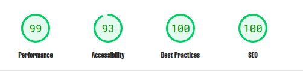

<p align="center">
    <a href="#" target="_blank">
        
    </a>
    <h1 align="center">Andr3sC0des - Stars</h1>
    <br>
</p>

## About The Project

Landing page created with Astro

## SEO Analytics

### Mobile Analytics 


### Desktop Analytics



## Screenshots

### Stars Main Page


## Preview

If you want to see working demo of the application ...

## Getting Started

Install the dependencies:

```sh
$ npm install
// or
$ yarn
```

Run in dev mode:

```sh
$ npm run dev
// or
$ yarn dev
```

## 🛠️ Stack

- [![Astro][astro-badge]][astro-url] - The web framework for content-driven websites.

[astro-url]: https://astro.build/
[astro-badge]: https://img.shields.io/badge/Astro-fff?style=for-the-badge&logo=astro&logoColor=bd303a&color=352563
